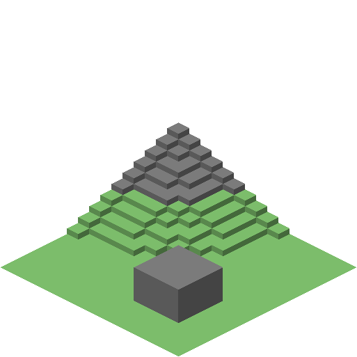

# NexusScan v1.1.0

Tracks every Overworld chunk any player has ever set foot in, and on a schedule (not
continuously) renders each one into a real isometric 3D-looking tile -- visible height, walls, and
structure, not a flat top-down color swatch -- painted with real vanilla block textures (grass
blades, stone speckle, wood grain, and so on), not flat color swatches -- the same basic *look*
Dynmap/BlueMap produce, just built from scratch as a custom, lightweight renderer rather than
either of those tools, and without their constant re-rendering or any live player tracking.
Nothing about a player's identity or position is ever stored; only the bare fact that a given
chunk has been visited.

**As of v1.0.0, this is a genuinely different renderer, not another tuning pass.** v0.1.0-v0.9.x
all rendered one flat, unmodulated (later relief-shaded) color square per block column -- no
amount of resolution or shading could ever show a wall, a roof, or real height, because that data
simply wasn't in the tile. v1.0.0 replaces that with `IsometricRenderer`: each column is drawn as
a shaded top face plus shaded side walls wherever it's taller than its east/south neighbor,
producing a real isometric picture -- at the *same* one-sample-per-column cost the v0.7.0
lag-elimination work already accounts for (no extra chunk loads, no extra main-thread work; only
the drawing step changed). The one honest limit that remains: this is still a heightfield renderer,
not full voxel ray-casting the way Dynmap/BlueMap actually work under the hood, so it can't show
what's under an overhang or inside an open structure -- getting that would mean a fundamentally
heavier renderer walking real voxel data, a much bigger undertaking than this version. The old flat
renderer is still in the source (`ChunkScanner`) and selectable via `rendering-mode: flat` in
config.yml as a fallback/rollback option, but isometric is the default from here on.

**v1.1.0 adds real vanilla block textures on top of that geometry.** v1.0.0's isometric faces were
still drawn in `BlockColorPalette`'s flat representative colors -- correct shapes and shading, but
a solid color per face, not an actual textured material. v1.1.0 downloads the real vanilla texture
images straight from Mojang's own servers (see "Real block textures" below) and maps them onto
every top/wall face with the same per-block tiling a real Minecraft cliff face would show, so a
stone cliff actually looks like stone, a plank wall actually shows wood grain, and so on -- while
keeping the exact same fail-safe design this whole plugin is built around: if the download hasn't
finished yet, or fails for any reason, tiles just keep using the v1.0.0 flat colors until (or
unless) real textures become available.

## What it does NOT do

- It does not track players live, does not know or store who visited a chunk or when, and never
  broadcasts anyone's position (unlike Dynmap/BlueMap's default live player markers).
- It does not re-render on every block change. It only re-scans on the configured interval
  (`scan-interval-hours`, default every 24h -- once a day).
- It does not run a web server. It writes tile images to a folder on disk (always, one per
  scanned chunk as it's scanned), and also pushes them straight to your Base44/Kairos app's
  webhook if `webhook.base-url` is configured -- incrementally, throughout the scan, not just
  once it finishes -- see "Getting this onto your website" below.
- Overworld only, on purpose, for this version. The End and Nether are planned as later updates
  (same approach, once you want them: a second configured world + a second tiles/<world>/ folder).

## How it works

1. **Backfill** (`RegionFileScanner`, off by default -- see below) -- reads just the 4KB header of
   every file in `<world>/region/*.mca` to find every chunk that's ever been generated and saved to
   disk, and seeds those straight into the visited set. This is what makes a server with years of
   history behind it show up immediately instead of starting from a blank map and only growing from
   whatever's visited from here on -- a chunk only exists on disk at all because something caused it
   to generate at some point. **As of v0.4.0 this is opt-in, run on demand with `/nexusscan
   backfill`**, not automatic on every startup: a chunk existing on disk is normally because a
   player got near it, but if any other plugin on your server also generates or imports terrain
   programmatically (a world importer, a pregenerator, etc.), the same header read can't tell the
   difference, and the "visited" count can end up wildly larger than real exploration -- which also
   means proportionally longer scans. `/nexusscan backfill` reports the count it *would* add before
   touching anything, specifically so that's easy to catch before it happens.
2. **Tracking** (`ChunkVisitTracker`) -- listens for players changing chunks (on join, and on any
   chunk-boundary crossing while moving) in the configured world only, and adds that chunk
   coordinate to a persistent set (`plugins/NexusScan/visited-chunks.txt`, one `x,z` per line,
   appended immediately as new chunks are found so nothing is lost on a crash). This is what keeps
   the map growing over time, whether or not the backfill above is ever used.
3. **Scanning** (`ScanEngine` + `IsometricRenderer`, or `ChunkScanner` if `rendering-mode: flat`) --
   on the configured interval (and once shortly after startup, so there's something to look at
   right away), takes every visited chunk and **orders it outward from `scan-origin-x`/
   `scan-origin-z` (spawn by default)** so the nearest-to-spawn chunk scans first and each one
   after that is farther out (the ordering itself happens on a background thread, since sorting
   millions of entries isn't main-thread-safe either). Then, engineered specifically to never cost
   the server noticeable main-thread time (see "How this stays off the server's toes" below): each
   chunk is loaded through Paper's async chunk API rather than forced open synchronously, read via
   one cheap snapshot copy rather than 256 live block lookups, and rendered/encoded/written to disk
   entirely on a background thread pool -- with a per-tick time budget (`max-tick-millis`, not just
   a chunk count) throttling how much of that dispatch work happens per tick.
4. **Local output** (`TileWriter`) -- each scanned chunk becomes one PNG (see "How the isometric
   renderer works" above for its fixed size) at
   `plugins/NexusScan/web/tiles/<world>/<chunkX>_<chunkZ>.png`, written as soon as that chunk is
   scanned. Once the whole scan finishes, a `manifest.json` is written alongside the tiles listing
   every tile's coordinates, the overall bounds, the last-scan timestamp, and (as of v1.0.0) the
   projection parameters the isometric renderer used -- this is a backup/debugging copy (see
   "Getting this onto your website" below for what the actual website uses), so it's only written
   once at the end rather than repeatedly during the scan, to avoid rewriting a potentially huge
   JSON file over and over.
5. **Base44 push** (`WebhookPusher`) -- **as of v0.4.0, this happens incrementally throughout the
   scan, not just once at the very end.** In isometric mode (the default), each scanned chunk's
   tile is queued directly at a single native level (no zoom pyramid, see "Known limitations"
   above); in legacy flat mode, each tile instead becomes the finest zoom level of a multi-zoom
   pyramid (`IncrementalPyramid`, `webhook.min-zoom`/`max-zoom`) built by combining/downsampling
   groups of 4. Either way, every `webhook.push-batch-chunks` scanned chunks (default 2000),
   whatever's changed since the last push gets base64-PNG-encoded and POSTed in batches
   (`webhook.tiles-per-request`) to `{webhook.base-url}{webhook.path}`, with the shared secret in
   the `x-kai-secret` header and a manifest describing the projection, on a background thread so it
   never blocks the server. This is what makes a huge visited area (millions of chunks) show up on
   the website progressively within minutes, instead of the whole map waiting for the last chunk in
   a scan that could take hours. A batch that fails is simply retried on the next scan cycle
   (resending the same `z`/`tx`/`ty` overwrites, per the webhook's own contract).

## How this stays off the server's toes

At millions of visited chunks, "spread the work across many ticks" isn't enough on its own -- three
things needed fixing specifically so scanning never costs noticeable main-thread time, however
large the visited set gets:

- **Chunks are never force-loaded synchronously.** Reading an unloaded (but already-generated)
  chunk the old way -- a live `World`/`Block` API call -- silently loads it from disk right there on
  the main thread, which is exactly the kind of I/O stall that lags a server for everyone. Every
  chunk now goes through `World#getChunkAtAsync`, which does any needed disk I/O off the main thread
  and only resumes on the main thread once the chunk is actually ready.
- **One snapshot instead of 256 live lookups.** A chunk's contents are read with a single
  `Chunk#getChunkSnapshot(...)` call (a cheap, Bukkit-documented thread-safe copy) instead of 256
  separate per-column API calls -- and that's the *only* step that still has to happen on the main
  thread. The actual color-mapping, PNG encoding, and file write all happen on a background thread
  pool (`background-threads`, default 2), since none of that touches Bukkit API at all.
- **Forced-open chunks get closed again**, immediately after their snapshot is taken
  (`unload-forced-chunks`, default on) -- otherwise a full scan would leave millions of chunks
  sitting in memory that nobody's actually using, which is its own path to server-wide lag (memory
  pressure, GC pauses) even with the above fixed.
- **The throttle measures real time, not a guessed chunk count.** `max-tick-millis` (default `3.0`)
  measures actual elapsed time each tick and stops dispatching once that budget's spent, so the scan
  self-adjusts to whatever else the server's doing or how fast the hardware is -- `chunks-per-tick`
  is now just a sanity ceiling underneath that, not the real limit.

If a scan still causes any noticeable lag on your server, lowering `max-tick-millis` (try `1.0`) is
the first thing to try; raising `background-threads` can help if scans feel slow rather than
laggy (background work competing with itself, not with the server).

## How the isometric renderer works

`IsometricRenderer` draws each chunk as a standard 2:1 pixel-art isometric projection: every
column becomes a diamond-shaped top face, plus a shaded wall face hanging below it wherever that
column is taller than its east (`x+1`) or south (`z+1`) neighbor. Columns are drawn back-to-front
(increasing `x+z`, the standard heightfield painter's algorithm) so a nearer column's top face
correctly overdraws a farther column's wall exactly where it should -- see a real synthetic example
below (a rolling hill plus a raised stone "house" -- generated as part of testing this, not a real
chunk from your server):



Two settings make this composable across many chunks into one continuous map, which is the entire
point of a world map (not just a nice-looking single tile):

- **`isometric.baseline-y`** (default `64`, vanilla sea level) is the world Y that maps to the
  *bottom* of every tile's height window. This is deliberately one fixed value for every chunk in
  the scan, not each chunk's own local minimum height -- that's what makes two neighboring chunks'
  tiles line up at the correct relative height when placed next to each other on the website,
  instead of each chunk floating at its own arbitrary "floor."
- **`isometric.height-window-blocks`** (default `64`) is how many blocks above `baseline-y` get
  real vertical room on the canvas. A column below the baseline is clamped up to it; a column more
  than this many blocks above it is clamped down to the top of the window (still gets a top face,
  just with its topmost relief flattened) -- this keeps every tile's canvas a fixed, predictable
  size regardless of how tall any one chunk's terrain happens to be. If your terrain generally sits
  well above or below vanilla sea level, moving `baseline-y` closer to your terrain's typical
  surface height (and/or raising the window) will make much better use of the available canvas
  than the defaults will.

`isometric.pixels-per-block` (default `6`) is the only sizing knob -- unlike the old flat
renderer's `tile-pixel-size`, this isn't upscaling the same fixed data; it's the actual size of the
projected geometry, so raising it produces a genuinely bigger, crisper tile (and a bigger file).

**This is a different tile shape than before, and your Base44/Kairos site's viewer will need real
changes to display it** -- not just a CSS tweak. The old flat tiles were simple square slippy-map
tiles a Leaflet-style viewer could zoom/pan like a normal map. Isometric tiles are diamond-shaped,
every tile is the *same* fixed pixel size (`tileWidth`/`tileHeight`, reported in both the webhook
manifest and the local `manifest.json`), and there's no zoom pyramid yet (see "Known limitations"
below) -- the site needs to position each chunk's tile at
`screenX = (chunkX - chunkZ) * 16 * pixelsPerBlock`, `screenY = (chunkX + chunkZ) * 16 *
(pixelsPerBlock / 2)` (both shifted by that same fixed offset every tile image already bakes in),
using the `pixelsPerBlock`/`baselineY`/`heightWindowBlocks` values the manifest sends. That's real
frontend work on the Base44/Kairos side, not optional polish.

## Real block textures

As of v1.1.0 (`isometric.use-real-textures`, default on), every top and wall face is painted with
the actual vanilla block texture instead of a flat color, using the same public mechanism
Dynmap/BlueMap/every other Minecraft map tool relies on:

1. **Download** (`MinecraftAssetDownloader`, background thread, once per configured Minecraft
   version) -- fetches Mojang's public `version_manifest_v2.json`, finds the entry for
   `isometric.minecraft-version` (default `1.21.1`), follows it to that version's own metadata
   JSON, and downloads the plain vanilla client jar from the URL Mojang's own metadata gives --
   verifying it against the SHA-1 hash that same metadata provides. This is the exact same public
   endpoint the official Minecraft launcher itself uses to fetch that jar; nothing is scraped,
   reverse-engineered, or pulled from an unofficial mirror, and nothing is bundled with or
   redistributed by this plugin -- your own server fetches it directly from Mojang, once, the first
   time real textures are turned on (or whenever `isometric.minecraft-version` changes).
2. **Cache** -- the downloaded jar is saved to `plugins/NexusScan/texture-cache/`, so this download
   only happens once per configured version, not once per server restart.
3. **Extract** (`extractTextures`) -- pulls just the block texture PNGs (`assets/minecraft/
   textures/block/*.png`) out of that jar and maps each one to the vanilla `Material` it belongs
   to, including the `_top`/`_side` naming convention vanilla texture files use (a block with only
   one texture file uses it for every face; a block with `_top`/`_side` variants -- grass, logs,
   etc. -- uses the right one per face). A handful of blocks (water, lava) have real texture
   filenames that don't follow the plain `material_name.png` convention at all -- those are handled
   with a small explicit filename map; any block not covered by that map or the naming convention
   simply falls back to its flat palette color rather than erroring.
4. **Paint** (`IsometricRenderer` + `TextureAtlas`) -- each texture is mapped onto its face with a
   real affine transform (the texture's square corners are mapped onto the diamond top face or the
   parallelogram wall face -- not just stretched into a bounding box), and wall faces tile one copy
   of the texture per block of height drop, the same way a real Minecraft cliff face repeats its
   texture per block rather than stretching one copy across the whole drop.

Two approximations worth knowing about, both safe/graceful rather than silent wrong data:

- **Grass and leaves are tinted, not per-biome.** Their real texture files are a neutral
  grayscale/white mask meant to be colored per-biome by the actual game client -- NexusScan doesn't
  have real per-biome color data, so it approximates this by tinting that mask with
  `BlockColorPalette`'s existing representative color for that block instead. It'll look like
  grass/leaves, just not necessarily the exact shade your biome would show in-game.
- **A version mismatch degrades, it doesn't break.** If `isometric.minecraft-version` doesn't
  closely match what the server actually runs, newer or renamed blocks just aren't in the
  downloaded jar's texture set and fall back to their flat palette color -- the rest of the map
  still renders normally.

This all happens on a background thread and never blocks server startup or a scan; check
`/nexusscan status` for a `Real block textures: ...` line telling you whether it's disabled, still
loading (normal for the first run or after a version change -- can take a little while depending on
your server's internet connection), or loaded and in use. Set `isometric.use-real-textures: false`
in config.yml to skip all of this and keep the v1.0.0 flat-color-per-face look.

## Known limitations (v1.1.0)

- **No zoomed-out overview yet.** Every isometric tile is pushed/written at one native resolution
  (one tile per chunk) -- there's no coarser "zoom out and see the whole continent at a glance"
  level the way the old flat renderer's tile pyramid provided. Zooming out on the website today
  means the browser shrinking many individual chunk tiles, not a purpose-built lower-detail render.
  A real isometric zoom pyramid (correctly compositing groups of neighboring chunks at their true
  relative isometric offsets) is a good next step if that's wanted.
- **Still heightfield-based, not voxel ray-casting.** Real walls, height, and outdoor structure are
  visible now -- but an overhang, a roof's underside, or the inside of an open structure still
  won't show, since there's still only one sampled block per column. Full interior/overhang detail
  would need a fundamentally heavier renderer walking real voxel data.
- **Overworld only.** The End and Nether are still a planned future update, same as before v1.0.0
  (same approach: a second configured world + a second tiles/<world>/ folder) -- not changed by
  this version.
- **Grass/leaves tinting is an approximation, not real per-biome color** (see "Real block textures"
  above), and a small, deliberately non-exhaustive set of block texture filenames that don't follow
  the usual naming convention fall back to a flat color instead of a real texture.

## Getting this onto your website

As of v0.2.0 this is wired directly: NexusScan pushes every scan's tiles straight to your Base44
app's `ingestWorldTiles` webhook (in addition to still writing the local files from step 3 above,
kept as a backup/debugging copy). Both settings needed for that are already filled in as of v0.2.1:

- `webhook.base-url` in config.yml is pre-filled with `https://kai-core-genesis.base44.app`.
- `webhook.secret` is pre-filled with the value generated for the `KAI_ROSS_WEBHOOK_SECRET`
  secret on the Base44 side -- paste that same value into Base44's Secrets settings (if you
  haven't already) and the two sides match with no further changes.

If either side ever changes (a new app domain, a rotated secret), update `config.yml` and run
`/nexusscan reload` (or restart) to pick it up.

`web-viewer-example/viewer.html` (shipped alongside this source, not part of the plugin jar) is a
small Leaflet-based reference viewer -- **it only works against `rendering-mode: flat`.** Isometric
tiles (the v1.0.0 default) are a fundamentally different shape (diamond, fixed-size, no zoom
pyramid -- see "How the isometric renderer works" above) that a slippy-map library like Leaflet
isn't built to display. Getting isometric tiles onto the Base44/Kairos site is real frontend work
on that side: position each chunk's tile with plain absolute CSS/canvas placement using the
`screenX`/`screenY` formula given above and the `pixelsPerBlock`/`baselineY`/`heightWindowBlocks`/
`tileWidth`/`tileHeight` fields the webhook manifest now sends (also in the local
`tiles/<world>/manifest.json`) -- there's no existing reference implementation for that shipped
with this version yet.

## Getting it running for the first time

1. `mvn clean package` this source against the real Paper API (the sandbox this was built in has
   no network access to `repo.papermc.io`, so only a stub-verified compile happened here -- see
   "Build" below). Drop the resulting `target/NexusScan-1.1.0.jar` into your server's `plugins/`
   folder.
2. Restart the server (a plugin reload isn't enough the first time -- `onEnable` needs to run).
   Check the console for `NexusScan enabled -- tracking N visited chunk(s) in 'world'...`. `N` will
   be whatever's already in `visited-chunks.txt` (0 on a brand-new install) -- backfilling from
   existing region files is a separate, deliberate step now (see next).
3. If this server has history behind it (played before NexusScan was installed) and you want that
   reflected on the map, run `/nexusscan backfill`. It reports how many chunks it *would* add
   without changing anything yet -- sanity-check that number against how much you'd actually
   expect to have explored. If it looks right, run `/nexusscan backfill confirm` to commit it. If
   it looks absurdly large (millions, or far more than you'd expect), you likely have another
   plugin that generates/imports terrain programmatically on this server -- skip committing it, or
   commit it and then use `/nexusscan resetvisited confirm` afterward to undo it.
4. Don't wait for the scheduled scan -- run `/nexusscan rescan` right away to force an immediate
   scan + Base44 push, so you can confirm it end-to-end without waiting the default 60s startup
   delay (or the 24h interval after that). Tiles now get pushed to Base44 *while the scan is still
   running* (every `webhook.push-batch-chunks` chunks, default 2000), so watch the console for the
   first `NexusScan: progress -- ...` line rather than waiting for "scan finished" -- on a large
   visited set that first progress push is what tells you it's actually working end-to-end.
5. Run `/nexusscan status` afterward. If `Visited chunks recorded` is 0 and you expected more, make
   sure you ran the backfill step above, and double check `world` in config.yml matches your actual
   Overworld's folder name. Watch the console for `NexusScan: pushed N tile(s) to Base44...`; a
   `401` in the log means the secret doesn't match what's in Base44's `KAI_ROSS_WEBHOOK_SECRET`, and
   a connection error means `webhook.base-url` is wrong or the server can't reach the internet.

### Upgrading from v0.3.0 (already has a backfilled `visited-chunks.txt`)

`backfill-on-startup` changed its default from `true` to `false` in v0.4.0, but an *existing*
`config.yml` already has `backfill-on-startup: true` written into it explicitly from before --
upgrading the jar alone won't change that value back, since config.yml is only filled in for keys
that don't already exist. If your visited-chunk count looks too large to be real exploration (for
example, it came from a backfill on a server that also runs a plugin generating terrain
programmatically), either set `backfill-on-startup: false` in config.yml yourself, or leave it and
just run `/nexusscan resetvisited confirm` once to clear the inflated set and start over with the
new opt-in `/nexusscan backfill` flow above.

## Commands (`nexusscan.admin`, default op)

- `/nexusscan status` -- world, rendering mode, real-block-texture load state (disabled/loading/
  loaded -- see "Real block textures" above), visited-chunk count, the scan-order origin point,
  whether a scan is currently running, when the last one started/finished, and the output folder
  path.
- `/nexusscan rescan` -- force a scan right now instead of waiting for the next scheduled interval.
- `/nexusscan reload` -- reloads config.yml. Note: `scan-interval-hours` and the startup-scan delay
  are only read once, at server start, to set up the repeating task -- changing those two in
  particular needs a restart to take effect.
- `/nexusscan backfill` -- reads the world's region files and reports how many chunks it *would*
  add to the visited set, without changing anything yet.
- `/nexusscan backfill confirm` -- commits the most recent `/nexusscan backfill` preview.
- `/nexusscan resetvisited` -- reports how many visited chunks exist right now (does nothing else).
- `/nexusscan resetvisited confirm` -- permanently clears the entire visited set. Irreversible; use
  this to undo a backfill that turned out to be too large.

## Config (`plugins/NexusScan/config.yml`)

- `world` -- which world to track/scan. Default `world` (your main Overworld).
- `backfill-on-startup` -- seed the visited set from every chunk that already exists in the
  world's region files, on every startup. Default `false` as of v0.4.0 -- use `/nexusscan backfill`
  instead to preview the count before committing it (see "How it works" above for why).
- `scan-interval-hours` -- how often a new scan starts. Default `24` (once a day). Tiles reach
  Base44 incrementally during each scan (see `webhook.push-batch-chunks` below), not just once a
  scan finishes, so this mainly controls freshness, not how long you wait to see anything.
- `scan-on-startup` / `startup-scan-delay-seconds` -- run one scan shortly after the server starts
  instead of waiting for the first interval. Default: on, 60s delay.
- `max-tick-millis` -- how many milliseconds per tick a scan may spend dispatching chunks before
  waiting for the next tick -- the real throttle as of v0.7.0 (see "How this stays off the server's
  toes" above). Default `3.0`; lower it if you notice any lag during a scan.
- `chunks-per-tick` -- a hard ceiling on chunks dispatched per tick, underneath `max-tick-millis`.
  Default `200`.
- `background-threads` -- size of the background thread pool that renders/encodes/writes tiles (and
  the Base44 push), entirely off the main thread. Default `2`.
- `unload-forced-chunks` -- close a chunk again after scanning it, if NexusScan was the one that had
  to open it. Default `true`; leave it on unless you have a specific reason not to.
- `scan-origin-x` / `scan-origin-z` -- block coordinates every scan orders chunks outward from (see
  "How it works" above), so the map fills in as an expanding area centered here rather than
  scattered tiles. Pre-filled with this server's actual world spawn (`-16649`, `9645`); a fixed
  config value, not read live from `/setworldspawn`.
- `output-directory` -- where tiles + manifest.json get written, relative to the plugin's data
  folder. Default `web`.
- `rendering-mode` -- as of v1.0.0, `isometric` (default) or `flat` (the pre-v1.0.0 renderer, kept
  as a fallback/rollback option). See "How the isometric renderer works" above.
- `isometric.pixels-per-block` -- horizontal pixel unit for the isometric renderer; bigger = a
  larger, crisper tile. Default `6`. Only read in isometric mode.
- `isometric.baseline-y` -- the world Y every tile's height window starts from, fixed across the
  whole map (not per-chunk) so neighboring tiles line up correctly. Default `64` (vanilla sea
  level). Only read in isometric mode.
- `isometric.height-window-blocks` -- how many blocks above `baseline-y` get real vertical room on
  the canvas before clamping. Default `64`. Only read in isometric mode.
- `isometric.use-real-textures` -- as of v1.1.0, paint real vanilla block textures on isometric
  faces instead of flat colors (see "Real block textures" above). Default `true`. Only read in
  isometric mode.
- `isometric.minecraft-version` -- which Minecraft version's textures to download, spelled the way
  Mojang's version manifest spells it (e.g. `"1.21.1"`). Default `"1.21.1"`. Only read when
  `isometric.use-real-textures` is also on.
- `tile-pixel-size` -- legacy flat-renderer tile size (a hard-edged nearest-neighbor upscale, see
  "How the isometric renderer works" above for why isometric mode doesn't use this). Default `64`.
  Only read when `rendering-mode: flat`.
- `relief-shading.enabled` / `relief-shading.strength` -- legacy flat-renderer depth cue: shades
  each column relative to its west neighbor's height. Default `true` / `0.06`. Only read when
  `rendering-mode: flat` (isometric mode gets real depth from projected geometry instead).
- `webhook.enabled` -- master on/off switch for the Base44 push. Default `true`.
- `webhook.base-url` -- your Base44 app's domain. Pre-filled with `https://kai-core-genesis.base44.app`.
- `webhook.path` -- the endpoint path. Default `/functions/ingestWorldTiles`.
- `webhook.secret` -- shared secret sent as the `x-kai-secret` header; must match Base44's
  `KAI_ROSS_WEBHOOK_SECRET`. Pre-filled with the value already generated for it.
- `webhook.min-zoom` / `webhook.max-zoom` / `webhook.tile-blocks-base` -- the tile pyramid's zoom
  range, matching the manifest fields `ingestWorldTiles` expects. Defaults `0` / `4` / `256`.
- `webhook.tiles-per-request` -- how many tiles go in each POST request. Default `200`.
- `webhook.push-batch-chunks` -- as of v0.4.0, how many scanned chunks trigger an incremental push
  of whatever's changed to Base44, instead of waiting for the whole scan to finish. Default `2000`.

## Color palette

`BlockColorPalette` maps the common terrain/surface blocks (grass, stone, sand, water, ores,
crops, wood/leaves/wool/concrete/terracotta families by name pattern, etc.) to a representative
flat color. As of v1.1.0 this is no longer the whole story for isometric mode -- it's now both the
*fallback* every face uses when real textures are off, still loading, or don't cover a given block
(see "Real block textures" above), and the basis for the grass/leaves biome-tint approximation used
even when real textures are on. `flat` mode (the pre-v1.0.0 renderer) still uses it exactly as
before, as the one and only color for every column. Any block the palette doesn't recognize renders
as loud magenta (`FF00FF`) on purpose, instead of silently guessing wrong -- if you spot magenta on
the map, that's this plugin telling you a block type is missing from the palette and needs adding.

Isometric mode (the default, see above) gets its depth from real projected geometry -- top faces
plus shaded side walls, now painted with real block textures by default -- rather than a shading
trick layered on a flat square. `flat` mode (the pre-v1.0.0 renderer, still available via
`rendering-mode: flat`) has no such geometry and no texture support at all, so it relief-shades
every column relative to its west neighbor's height instead (rising ground brighter, falling
ground darker -- `relief-shading.enabled`/`relief-shading.strength` in config.yml) as its only
depth cue -- see "Known limitations" above for what's still not covered by either renderer.

## Build

```
mvn clean package
```

Produces `target/NexusScan-1.1.0.jar`. Requires Java 21 and network access to `repo.papermc.io` /
Maven Central. See CHANGES.md for how this was verified in the sandbox (a from-scratch stub
library covering this plugin's Bukkit API surface, `javac -Xlint:all -Werror`: 0 errors, 0
warnings) -- run your own `mvn clean package` against the real Paper API.
